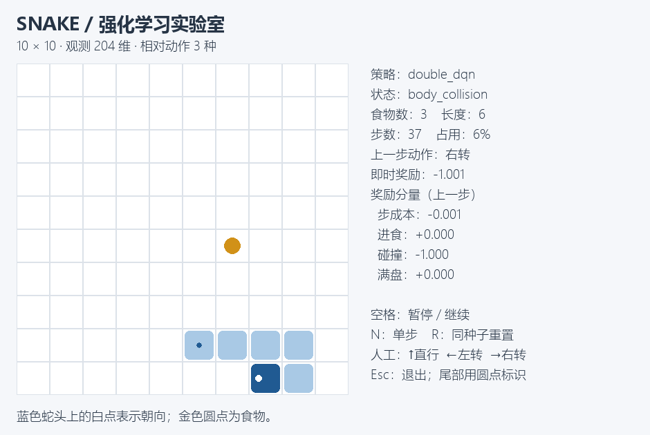

# RLtoGame

通过贪吃蛇、马里奥与 Minecraft 的游戏智能体，学习强化学习的建模、训练、评估和多智能体方法。

**当前交付：单蛇强化学习模块。** 包含自行实现的游戏环境、两种基线、手写 DQN / Double DQN、真实实验、中文讲义与桌面演示。适合会 Python、刚开始学习深度学习和强化学习的读者。

[快速运行](#快速运行) · [单蛇文档](snake/README.md) · [实验报告](snake/reports/single_snake_report.md) · [更新日志](CHANGELOG.md) · [实验数据说明](snake/reports/data/README.md)



## 能做什么

- 手动玩贪吃蛇，或观察随机策略、启发式与学习策略；支持暂停、单步和重置。
- 从 204 维观测到三种相对动作，逐步阅读环境、经验池、TD 目标和训练循环。
- 自己训练 DQN / Double DQN，保存与恢复训练，绘制曲线并分析失败轨迹。
- 按中文讲义手算一次更新，再用同种子、相同预算的实验检验学习效果。

## 快速运行

以下为 **Windows PowerShell** 命令。本次实测环境是 Python 3.13.6；其他平台尚未验证。

```powershell
git clone https://github.com/555apex/RLtoGame.git
Set-Location RLtoGame
python -m venv snake/.venv
# 快速体验环境与基线，不需要 PyTorch 或训练权重
snake/.venv/Scripts/python -m pip install -r snake/requirements-stage1-lock.txt
snake/.venv/Scripts/python -m snake.demo --policy heuristic --seed 1000
```

空格暂停/继续，N 单步，R 重置，Esc 退出。将策略改为 `--policy human` 可以手动体验：↑ 直行、← 左转、→ 右转，均相对蛇头朝向。

**想训练神经网络或重建最终报告？** 按 [单蛇安装与训练说明](snake/README.md#安装完整训练环境) 安装完整依赖。本次源码提交包含图表与实验日志；训练权重、虚拟环境和大体积恢复文件不纳入 Git，权重附件尚未发布。新克隆可以直接运行基线，学习模型需要自行训练或取得对应权重。

## 真实实验结果

DQN、Double DQN 各训练种子 0、1、2，每次 300,000 环境步，总计 **1,800,000 步**。先按独立验证集选模并冻结，再执行 **220 局测试**，包含学习前的初始网络对照。

| 方法 | 测试平均食物数 | 统计说明 |
| --- | ---: | --- |
| 初始网络 | 0.100 | 三个初始模型均值的平均 |
| 均匀随机 | 0.150 | 固定策略，20 局 |
| 曼哈顿启发式 | 19.100 | 固定策略，20 局 |
| DQN | 0.850 ± 0.218 | 三个模型各 20 局；± 为模型均值的样本标准差 |
| Double DQN | 0.850 ± 0.229 | 同上 |

三个种子均出现相对初始网络的觅食提升，但学习策略明显弱于启发式。本次没有观察到 Double DQN 的平均优势；两种学习方法都频繁截断，尚无满盘成功。报告保留负面结果、循环与身体碰撞案例，不把完成训练当作策略能力保证。


证据入口：[完整报告](snake/reports/single_snake_report.md) · [逐种子解读](snake/reports/single_snake_findings.md) · [原始数据与校验](snake/reports/data/README.md)。开发时 **82 项检查通过**，依赖检查通过。

## 阅读路线

| 你的目标 | 从这里开始 |
| --- | --- |
| 初识状态、动作、奖励与回合 | [第一课：强化学习与贪吃蛇](snake/learning/01_rl_and_snake.md) |
| 理解神经网络与手写 DQN | [第二课：张量与 DQN](snake/learning/02_tensors_and_dqn.md) |
| 理解 Double DQN 与多种子统计 | [第三课：Double DQN 与可信实验](snake/learning/03_double_dqn_and_experiments.md) |
| 启动演示，讲解成功与失败行为 | [演示操作与讲解稿](snake/learning/04_demo_walkthrough.md) |
| 准备考核与答辩 | [复盘题与参考答案](snake/learning/03_exercises_and_defense.md) |
| 了解完整开发过程与当前边界 | [开发记录](PROGRESS.md) |

## 项目结构与范围

```text
RLtoGame/
├── snake/       # 单蛇已交付；双蛇同步对抗与自博弈待开发
├── mario/       # 视觉强化学习项目，预留
├── minecraft/   # 选做项目，预留
├── outputs/     # 课程任务概述与开发依据
├── CHANGELOG.md # 面向读者的更新日志
└── PROGRESS.md  # 真实实验与开发取舍记录
```

三个游戏各自使用独立环境。贪吃蛇整个项目还包括双蛇，本次交付不代表三个游戏或综合报告已全部完成。每个完整游戏项目完成后，会提供覆盖奖励设计、训练、可视化和实时游玩的全流程体验指南。

## 来源与贡献说明

任务规则来自 [课程概述](outputs/强化学习大作业概述与开发指南.md)。算法、接口和依赖来源在报告中列出。代码、检查、讲义和报告使用 AI 辅助开发；学生的独立理解、修改和复现情况需要据实记录，不虚构个人完成经历。

本次为源码与实验材料提交，未创建 Release 或发布模型附件。后续模块提交和附件发布按项目协作约定单独安排。
