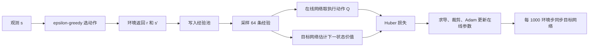

# 第二课：用神经网络学习动作价值

先读第一课并能解释 `env.step()` 的五个返回值，再开始本课。建议分三次学习：张量与梯度、DQN 更新、训练与复现；每次 45–60 分钟。这里的时间是学习安排，不是对掌握程度的保证。

## 1. 我们终于开始“学习”什么

启发式的规则由人提前写死。DQN 的策略则依赖一个有参数的函数：输入棋盘观测，输出三个动作各自的估计长期价值。与环境交互后，算法调整参数，使估计更接近新的学习目标。

$$
Q_\theta(s,a)\approx \mathbb E\!\left[\sum_{k=0}^{T-t-1}\gamma^k r_{t+k+1}\mid s_t=s,a_t=a\right].
$$

`θ` 是网络参数，`Q` 是动作价值。输出 `[0.2, 0.5, −0.8]` 表示网络估计左转更值得选，**不是**三个动作的概率，也不等于马上能吃到多少食物。当前奖励包含步成本、食物和碰撞，所以 Q 的单位是折扣奖励。

## 2. 张量：有形状的数字集合

张量可以先理解为支持自动求导的多维数组。单个观测是 `[204]`，一次处理 64 条经验时形状是 `[64,204]`。第二个维度永远是特征数，不能把 batch 维误当成棋盘维。

| 代码中的数据 | 形状 | 含义 |
| --- | --- | --- |
| `observations` | `[64,204]` | 64 个状态 |
| `online(observations)` | `[64,3]` | 每状态三个动作的 Q 值 |
| `actions` | `[64]` | 每条经验真正执行的动作 |
| `gather(...).squeeze(1)` | `[64]` | 取出每条经验对应动作的 Q 值 |
| `targets` | `[64]` | 每条经验的 TD 目标 |

网络为 `204 → 128 → 128 → 3`，两个隐藏层后使用 ReLU：

$$
h_1=\max(0,W_1s+b_1),\quad h_2=\max(0,W_2h_1+b_2),\quad Q=W_3h_2+b_3.
$$

共有 `(204×128+128)+(128×128+128)+(128×3+3)=43139` 个参数。末层没有 softmax，因为 Q 值允许为负，不需要加起来等于 1。

## 3. 梯度更新究竟做了什么

先看一个简单模型 `ŷ=wx+b`。给定 `x=2`、目标 `y=3`，初始 `w=1,b=0`，预测是 2。令损失为 `L=(ŷ−y)²/2`，则：

$$
\frac{\partial L}{\partial w}=(\hat y-y)x=-2,\qquad
\frac{\partial L}{\partial b}=\hat y-y=-1.
$$

学习率为 0.1 时，一次梯度下降得到 `w=1.2,b=0.1`，新预测为 2.5，比原先的 2 更接近 3。这个例子解释“减少误差”的方向；实际 DQN 用 Adam 和 Huber 损失，并不是这一个神经元。

运行本课的小实验：

```powershell
snake/.venv/Scripts/python -m snake.learning.dqn_math
```

PyTorch 的 `loss.backward()` 自动计算梯度，`optimizer.step()` 根据梯度更新参数；`zero_grad()` 清掉上一轮残留，防止梯度不小心累加。

## 4. 没有老师告诉正确动作，目标从哪里来

一条经验为 `(s,a,r,s',terminated,truncated)`。环境给了实际奖励 `r`，但未来回报还不知道。DQN 用目标网络对下一状态作估计：

$$
y=r+\gamma(1-d)\max_{a'}Q_{\theta^-}(s',a'),\qquad d=I_{\rm terminated}.
$$

这叫 bootstrap：用已有估计构造新的学习目标。`θ⁻` 是延迟更新的目标网络参数；目标不是完美真值，而是训练过程中不断修正的估计。

本项目真实实现位于 `agents/dqn.py` 的 `dqn_targets()`：

```python
next_values = next_q_values.max(dim=1).values
return rewards + gamma * (~terminated).float() * next_values
```

例如 `r=1, γ=0.9, max Q_target(s')=3`：普通移动的目标为 3.7；真实终止的目标为 1；仅外部时间截断时仍为 3.7。终止和截断都结束一次采样，但不能都用来清零未来价值。

`@torch.no_grad()` 和目标网络 `requires_grad_(False)` 让目标这条计算路径不参与求导。我们只更新在线网络，避免两个网络一起追着当前误差跑。

Huber 损失在误差较小时像平方损失，较大时像绝对误差：

$$
\ell(\delta)=\begin{cases}\frac12\delta^2,&|\delta|<1,\\ |\delta|-\frac12,&|\delta|\ge1,\end{cases}
\quad \delta=Q_\theta(s,a)-y,\quad L=\frac1B\sum_i\ell(\delta_i).
$$

## 5. 三个稳定训练的机制

**经验回放。** 当前经验先进入容量 50000 的环形数组；满了以后覆盖最旧槽位。每次从有效经验中均匀抽取 64 条，无放回采样。这样可以复用交互记录，并减弱连续轨迹的相关性。经验池不等于保存“好经验”的排行榜。

**目标网络。** 在线网络每 4 个环境步更新一次，目标网络每 1000 个环境步复制一次在线参数。两个周期的单位都是环境步，不能混成梯度更新次数。目标网络不是第二个独立玩家。

**epsilon-greedy。** 以 `ε` 概率均匀选择一个动作，否则选最大 Q。ε 从 1.0 在前 100000 步线性降到 0.05，之后保持 0.05。评估时为 0，并不消耗训练的探索随机源。探索中的危险动作不能偷偷屏蔽。

初始先积累 1000 条经验。在第 1000 步满足更新条件后开始优化；第 300000 步结束时应累计 `(300000−1000)/4+1=74751` 次更新。

## 6. 一次训练循环的阅读顺序



按以下顺序打开源码，每一步能用自己的话说出输入输出再继续：

1. `agents/dqn.py:QNetwork`：解释为什么输入 204、输出 3，理解 batch 维。
2. `agents/replay.py:ReplayBuffer.add/sample`：解释环形覆盖、数据副本和两种结束标记。
3. `agents/dqn.py:dqn_targets/update`：把每行代码对应到上面的公式；定位 gather、no_grad 和梯度裁剪。
4. `training.py:Trainer.interact`：把单步环境交互与一次更新连接起来。
5. `training.py:validation_episodes/validate`：说明为什么使用新环境和固定验证种子。
6. `training.py:state_dict/load_state_dict`：列出继续训练所需的状态。
7. `reports/stage2_report.md`：区分训练误差下降、验证觅食改善和真实泛化结论。

## 7. 保存权重不等于保存训练

轻量策略文件 `initial.pt/best.pt/last.pt` 包含在线权重、观测动作协议、网络配置、训练种子与步数，供评估与演示使用。

`resume.pt` 还保存优化器、目标网络、经验池、探索/采样/环境随机源、未结束回合的棋盘、计数器、探索进度和验证最优模型。单蛇模拟器状态小，因此当前实现可以恢复原回合，无需伪造一次终止或重置。相同机器和依赖下的短 CPU 测试已验证恢复后轨迹、更新结果一致；不承诺跨设备、跨版本逐位一致。

恢复时 `--steps 300000` 表示累计目标 300000 步，不是再加 300000 步。必须输出到新运行目录，记录父存档哈希，不覆盖原实验。改变学习率等关键配置需要新实验，不能伪装成无变化续训。

## 8. 本阶段能下什么结论

本阶段运行 DQN 的训练种子 0，并在固定验证集上选模型。这是学习实现与诊断实验，不足以证明多种子稳定提升。完整课程实验还需要 DQN 另外两个训练种子、Double DQN 的受控对照，以及模型冻结后的保留测试。

如果智能体长时间绕圈，先比较食物数和截断数，再查看状态/奖励/更新是否正确。不要仅凭 loss 下降说“已经学会”；也不要因为验证不理想就改用测试集挑参数。

## 参考阅读

- [PyTorch 张量与基础教程](https://docs.pytorch.org/tutorials/beginner/basics/intro.html)：本课需要 Tensors、Build Model、Autograd、Optimization。
- [PyTorch 官方 DQN 教程](https://docs.pytorch.org/tutorials/intermediate/reinforcement_q_learning.html)：用于核对 DQN 的概念与 PyTorch 操作。本项目按课程规则自行实现环形回放、硬同步、线性探索和训练调度，不照搬该教程的 CartPole 配置。
- [DQN 原论文](https://www.nature.com/articles/nature14236)：了解经验回放和目标网络的研究背景。
- [Gymnasium 时间限制说明](https://gymnasium.farama.org/tutorials/gymnasium_basics/handling_time_limits/)：核对 terminated 与 truncated 的含义。
- [PyTorch 安装与版本](https://pytorch.org/get-started/previous-versions/)：安装版本需要与实际硬件验证配合。
