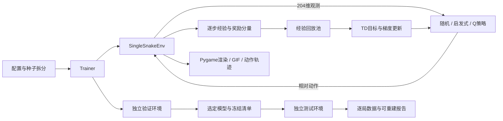
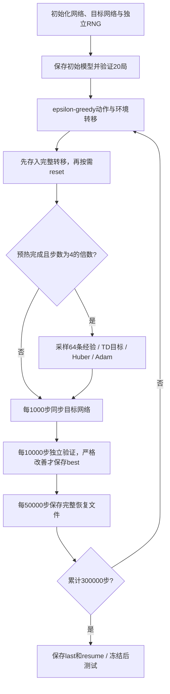
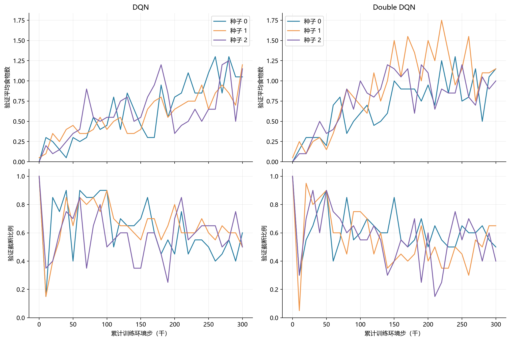
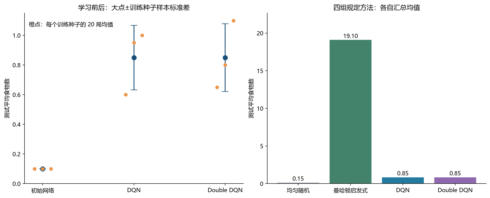
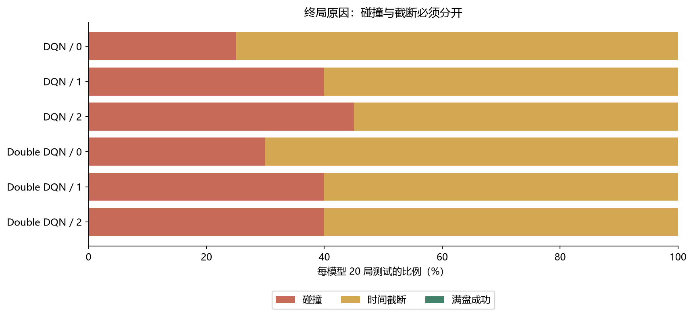
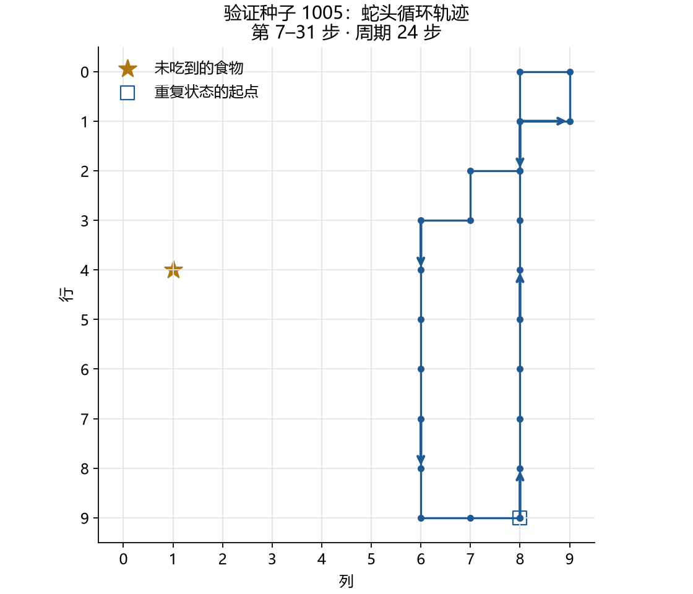

# 单蛇强化学习实验报告

> 本报告覆盖单蛇模块，后续并入包含双蛇和马里奥的综合报告。阶段一、二报告保留其当时的实验范围。本报告由 `python -m snake.build_final_report` 从归档数据生成。

## 摘要

本项目自行实现 10×10 单蛇环境，比较均匀随机、曼哈顿启发式、手写 DQN 与 Double DQN。两种学习方法各使用三个训练种子、每种子 300000 环境步，共 1800000 步。按独立验证集选择模型并冻结后，在相同 20 个测试环境种子上评估每个模型，同时评估初始未更新网络。

最终测试中，DQN 的跨训练种子平均食物数为 **0.850 ± 0.218**，Double DQN 为 **0.850 ± 0.229**；± 表示三个模型均值的样本标准差。初始网络均值为 0.100，均匀随机为 0.15，启发式为 19.10。具体逐种子表现见结果表。当前配置的学习能力仍弱于启发式；预算完成与算法检查通过不代表获得高质量策略，也不能保证满盘成功。

## 1. 任务建模与规则

状态由有序蛇身、食物位置和朝向组成。食物在空格中均匀采样；给定当前游戏状态和动作，除进食后新食物采样外，转移确定。初始身体按头到尾为 `(5,5), (5,4), (5,3)`，朝右。坐标从 0 开始，先行后列。

动作固定 `0/1/2 = 直行/左转/右转`，每次转向后前进一格，不能直接反向。未进食时尾格同步腾空，进入该格合法；进食增长一格。撞墙或撞身体为真正终止；身体达到 100 格时成功终止且不再生成食物。每局最多 2000 步是外部时间截断，不额外添加饥饿死亡；若同一步真正终止，终止优先。

观测为 `float32[204]`：先将有序身体图按行展平 100 格，空格为 0，头至尾填入 `1/100, 2/100, …, L/100`；随后是 100 格二值食物图，最后四维为上、右、下、左的方向 one-hot。顺序可以恢复，策略能获得完整游戏状态。2000 步外部计数不作为游戏终止状态输入；价值学习对时间截断继续 bootstrap。


奖励按分量叠加：

$$r_{t+1}=-0.001+I_{\mathrm{food}}-I_{\mathrm{collision}}+10I_{\mathrm{full}}.$$

例如普通移动 −0.001，进食 0.999，碰撞 −1.001，填满最后一格 10.999；截断没有额外惩罚。优化目标为期望折扣累计回报：

$$J(\pi)=\mathbb E_\pi\left[\sum_{t=0}^{T-1}\gamma^t r_{t+1}\right],\qquad \gamma=0.99.$$

报告主要指标为食物数，另列长度、占用率、步数、未折扣回报、碰撞、截断和满盘次数。日志回报和训练的折扣目标是不同量；延长存活也不等于增加食物。

## 2. 环境工程与验证

环境遵循 Gymnasium 接口：`reset → (obs, info)`，`step → (obs, reward, terminated, truncated, info)`。游戏规则与 Pygame 渲染分开；训练不创建桌面窗口。每次观测重新分配数组，回放池写入时复制，避免未来转移覆盖历史经验。



检查覆盖进食、转向、身体/墙碰撞、腾空尾格、满盘、奖励叠加、终止优先、相同种子可复现和观测副本，并通过 Gymnasium 环境检查。算法检查包含可手算目标、梯度阻断、在线更新、目标冻结与同步、验证不污染训练状态、模型保存加载，以及 CPU 中途恢复后的逐步一致性。实际 pytest 结果保存在 `data/checks_stage3.xml`。

网络为 `204 → 128 → 128 → 3`，隐藏层 ReLU，共 43139 个参数。三维输出是动作价值，不是动作概率。代码使用 PyTorch 基础层、Adam 和自动求导，经验池、探索、目标、训练循环均由本项目实现，没有调用现成 DQN 训练器。

## 3. 四组策略与算法

均匀随机在三个动作中等概率采样，不屏蔽危险动作。启发式仅通过同一观测恢复状态，排除立即碰撞后选择到食物曼哈顿距离最小的动作；并列依次直行、左转、右转；全部危险则直行。其安全筛选属于规定策略本身，DQN 不额外采用该筛选。

### 3.1 DQN

在线网络参数为 $\theta$，目标网络为 $\theta^-$，真正终止标志为 $d_i$：

$$y_i^{DQN}=r_i+\gamma(1-d_i)\max_{a'}Q_{\theta^-}(s'_i,a').$$

以下函数直接摘取正式运行的源码快照：

```python
@torch.no_grad()
def dqn_targets(rewards: torch.Tensor, terminated: torch.Tensor,
                next_q_values: torch.Tensor, gamma: float) -> torch.Tensor:
    """y = r + gamma * (1 - terminated) * max Q_target(s', a')。

    truncated 不进入掩码：外部时间预算用尽时，底层游戏仍有后续价值。
    """
    next_values = next_q_values.max(dim=1).values
    return rewards + gamma * (~terminated).float() * next_values
```

### 3.2 Double DQN

Double DQN 将下一动作的选择与评价分开，保持其他条件一致：

$$a_i^*=\arg\max_{a'}Q_\theta(s'_i,a'),\qquad
y_i^{DDQN}=r_i+\gamma(1-d_i)Q_{\theta^-}(s'_i,a_i^*).$$

```python
@torch.no_grad()
def double_dqn_targets(rewards: torch.Tensor, terminated: torch.Tensor,
                       online_next_q: torch.Tensor, target_next_q: torch.Tensor,
                       gamma: float) -> torch.Tensor:
    """在线网络选动作，目标网络评估该动作；其余目标语义与 DQN 一致。"""
    next_actions = online_next_q.argmax(dim=1, keepdim=True)
    next_values = target_next_q.gather(1, next_actions).squeeze(1)
    return rewards + gamma * (~terminated).float() * next_values
```

设计动机是缓解最大化操作与估计误差共同导致的价值高估，不保证每个任务或训练种子都有更高分数。[Double DQN 原论文](https://arxiv.org/abs/1509.06461)提供了算法来源；本任务结论只来自本地实验。当前没有测量真实 Q 值，因此不能把食物数变化直接解释为“已证实高估减少”。

两者均最小化 Huber 损失（PyTorch `smooth_l1_loss`，默认阈值 1）：

$$L(\theta)=\frac1B\sum_i h(Q_\theta(s_i,a_i)-y_i),\quad
h(e)=\begin{cases}\frac12e^2,&|e|\le1,\\|e|-\frac12,&|e|>1.\end{cases}$$

TD 目标停止梯度，梯度只经当前 `Q(s,a)` 更新在线网络。只有 `terminated` 阻断后继价值；外部截断用 reset 前的下一观测继续计算。[Gymnasium 时间上限说明](https://gymnasium.farama.org/tutorials/gymnasium_basics/handling_time_limits/)支持这一区分。

### 3.3 训练流程与恢复



初始、验证最优与末次模型分别为 `initial.pt`、`best.pt`、`last.pt`。`resume.pt` 保存在线/目标网络、优化器、经验池、训练进度、当前环境和全部相关随机状态；恢复到新运行目录，记录父存档。短 CPU 检查验证了回合中途恢复后的轨迹与参数一致，不承诺跨设备/版本逐位相同。

## 4. 受控实验设计

| 条件 | 取值 |
| --- | --- |
| 两种算法训练种子 | 各 0、1、2 |
| 交互预算 | 每次 300000，总计 1800000 环境步 |
| 优化器 | Adam，学习率 0.001，折扣 0.99 |
| 回放池 / batch / 预热 | 50000 / 64 / 1000 条 |
| 学习 / 目标同步频率 | 每 4 / 1000 环境步 |
| 梯度范数上限 | 10 |
| epsilon | 前 100000 步从 1.0 线性降到 0.05，之后保持；评估 0 |
| 训练 / 验证 / 测试环境种子 | 0–999 / 1000–1019 / 10000–10019 |
| 验证及选模 | 初始及每 10000 步各 20 局；均值最高、同分较早 |
| 设备 | CPU，PyTorch 单线程 |

每个训练回合用独立随机源从训练种子列表采样并记录；验证使用新环境，不改变训练棋盘或探索/回放随机状态。两个配置 JSON 除 `algorithm` 外一致。DQN 种子 0 复用阶段二完整训练，不重复消耗预算；其归档与新增代码经过五次相同 batch 更新逐位比较，Trainer 类的语法树也一致。各运行保留各自真实源码标识，不能把所有运行写成同一个源码哈希。

冻结时间（UTC）为 `2026-09-10T03:08:20.002834+00:00`，测试开始为 `2026-09-10T03:08:29.565549+00:00`。冻结清单 SHA-256 为 `46478431f533317b28885ae534535399382b6b6b160ea0c94192a2e2cba6cb0f`。清单保存全部模型、配置与核心代码哈希，测试入口核验后才运行。

六个 best 各测试 20 局；同种子初始网络的张量在两算法间逐项一致，三个初始对照共测试 60 局，固定基线共 40 局，合计 220 局。测试没有参与选模，也未触发改参或额外加训。桌面展示模型 `double_dqn_seed1_best` 在测试前按最高验证均值选定。

对学习方法，先计算训练种子 $k$ 的 20 局平均 $m_k$，再汇总三个 $m_k$ 的均值和样本标准差：

$$m_k=\frac1{20}\sum_{j=1}^{20} f_{k,j},\quad
\bar m=\frac13\sum_{k=0}^{2}m_k,\quad
s=\sqrt{\frac{\sum_{k=0}^{2}(m_k-\bar m)^2}{2}}.$$

三个种子只是有限重复，标准差不是置信区间。同一个训练模型的 20 局不是 20 次独立训练。固定基线没有训练种子，只列回合间标准差。同一个环境种子提供共同初始条件，但策略不同会导致后续轨迹不同。

## 5. 真实结果

### 5.1 各训练种子的预算、验证选模与耗时

| 方法 | 训练种子 | best 步数 | 最优验证食物均值 | 梯度更新次数 | 训练秒数 | 运行段墙钟秒数 | 峰值工作集 MiB |
| --- | ---: | ---: | ---: | ---: | ---: | ---: | ---: |
| DQN | 0 | 260000 | 1.30 | 74751 | 79.7 | 104.3 | 1062.2 |
| DQN | 1 | 300000 | 1.20 | 74751 | 82.0 | 107.4 | 1140.3 |
| DQN | 2 | 280000 | 1.25 | 74751 | 79.4 | 101.6 | 1140.7 |
| Double DQN | 0 | 240000 | 1.30 | 74751 | 112.7 | 143.3 | 1140.4 |
| Double DQN | 1 | 220000 | 1.75 | 74751 | 95.5 | 120.4 | 1140.7 |
| Double DQN | 2 | 140000 | 1.20 | 74751 | 107.2 | 134.2 | 1140.7 |

环境为 Windows、Python 3.13.6、PyTorch 2.7.1+cu128、Gymnasium 1.3.0；完整版本见 `../requirements-lock.txt`，硬件细节见每次 manifest。RTX 5070 Ti 已验证可更新，但阶段二独立吞吐测量中 CPU 约 4014 步/秒、GPU 约 1487 步/秒，因此小型 MLP 使用 CPU。原始测量见 `data/dqn_device_benchmark_isolated.json`。

训练秒数排除周期验证和存档，包含交互、梯度更新和逐步日志；运行段墙钟另含验证和存档，计时起点在 Trainer 初始化之后。各次用时是本机一次实际测量，后台负载等会影响它，不据此声称跨硬件性能优势。



曲线逐点来自每 10000 步的 20 局验证，没有额外平滑。它用于解释学习过程，不代替独立测试；最优点不一定在最后一次，波动也说明损失更新不保证分数单调提高。

### 5.2 每个冻结模型的 20 局测试

| 方法 | 训练种子 | 食物均值 | 回合标准差 | 平均长度 | 平均占用率 | 平均步数 | 平均回报 | 碰撞 | 截断 | 满盘 |
| --- | ---: | ---: | ---: | ---: | ---: | ---: | ---: | ---: | ---: | ---: |
| DQN | 0 | 0.60 | 0.75 | 3.60 | 3.60% | 1507.2 | -1.157 | 5/20 | 15/20 | 0/20 |
| DQN | 1 | 0.95 | 1.10 | 3.95 | 3.95% | 1214.0 | -0.664 | 8/20 | 12/20 | 0/20 |
| DQN | 2 | 1.00 | 0.97 | 4.00 | 4.00% | 1117.7 | -0.568 | 9/20 | 11/20 | 0/20 |
| Double DQN | 0 | 0.65 | 0.93 | 3.65 | 3.65% | 1408.5 | -1.058 | 6/20 | 14/20 | 0/20 |
| Double DQN | 1 | 0.80 | 1.11 | 3.80 | 3.80% | 1214.8 | -0.815 | 8/20 | 12/20 | 0/20 |
| Double DQN | 2 | 1.10 | 0.91 | 4.10 | 4.10% | 1213.0 | -0.513 | 8/20 | 12/20 | 0/20 |
| 初始网络 | 0 | 0.10 | 0.31 | 3.10 | 3.10% | 1900.2 | -1.850 | 1/20 | 19/20 | 0/20 |
| 初始网络 | 1 | 0.10 | 0.31 | 3.10 | 3.10% | 2000.0 | -1.900 | 0/20 | 20/20 | 0/20 |
| 初始网络 | 2 | 0.10 | 0.31 | 3.10 | 3.10% | 2000.0 | -1.900 | 0/20 | 20/20 | 0/20 |
| 均匀随机 | — | 0.15 | 0.37 | 3.15 | 3.15% | 18.7 | -0.869 | 20/20 | 0/20 | 0/20 |
| 曼哈顿启发式 | — | 19.10 | 6.45 | 22.10 | 22.10% | 159.4 | 17.941 | 20/20 | 0/20 | 0/20 |

原始数据为 `data/final_experiment_v1/test/episodes.csv`。初始网络行来自三个零更新模型，同时作为两种算法对应种子的对照；不能把同一初始模型重复计成两个独立样本。

### 5.3 跨训练种子结果与学习增益

| 方法 | 三个模型的食物均值平均 | 三个模型均值的样本标准差 |
| --- | ---: | ---: |
| 初始网络 | 0.100 | 0.000 |
| DQN | 0.850 | 0.218 |
| Double DQN | 0.850 | 0.229 |



左图大点为跨种子均值，误差线为样本标准差，橙点为各模型均值。右图展示四组规定方法的汇总，固定基线各 20 局、学习方法各三个模型×20 局，不混用两种标准差口径。



该结果支持在本次固定预算、固定表示和测试集合下比较方法；更广泛结论需要更多独立训练和任务条件。结合逐种子初始对照判断实际学习增益，不能仅用“执行了梯度更新”作为有效学习的证据。结果解读与配对增益见相邻的 `single_snake_findings.md`。

## 6. 失败分析与证据边界

**循环而不觅食。** 固定的 DQN 种子 0 best 在验证环境 1005 中，第 7 与第 31 步观测完全相同，此后身体、食物、朝向与动作按 24 步周期重复，最后 2000 步截断且食物数为 0。完整轨迹保留于 `data/dqn_seed0_loop1005.json`；模型是本次六个正式模型之一。没有进食就不会触发新食物随机性，确定策略在相同观测上返回同一动作，因此可以持续重复。



**进食后身体碰撞。** 同一 DQN 模型在验证环境 1000 中 58 步后身体碰撞，得到 2 个食物，完整观测/动作/奖励轨迹位于 `data/dqn_seed0_seed1000.jsonl`，本机 GIF 位于 `assets/dqn_seed0_seed1000.gif`。可在最后几步暂停，核对蛇头移动与身体占用。这说明已有觅食行为仍未形成可靠的避障决策。

启发式在验证环境 1000 中吃到 10 个食物后也被自身围住。只检查一步安全和到食物的距离不等于长期规划；其强于当前网络也不能说明它已解决满盘任务。上述案例都来自验证种子，并非挑选测试冠军录像。

可能的机制包括稀疏进食信号、初期探索覆盖不足、展平 MLP 对局部几何关系学习困难，以及折扣下循环的低短期成本。但本轮只改变了 TD 目标，没有做奖励/表示/探索消融，以上均为待验证假设。以循环为例，持续 −0.001 的无限折扣和约为 −0.1，而立即碰撞约为 −1.001，这解释了避险循环可能相对有吸引力，不证明当前网络准确估计了这些价值或找到了最优策略。

技术异常与策略失败分别记录。本轮正式训练和测试的完成记录须齐全；碰撞与截断是正常任务结果，不能作为程序异常删掉。异常文件存在时不能用替换种子隐瞒。

## 7. 复现、交付与个人贡献

安装及桌面操作见 [单蛇 README](../README.md)。在仓库根目录执行：

```powershell
snake/.venv/Scripts/python -m pytest -c snake/pytest.ini snake/checks
# 仅读归档，重建报告和图表，不再训练或访问测试环境
snake/.venv/Scripts/python -m snake.build_final_report
# 加载现有模型，可空格暂停，N单步，R重置
snake/.venv/Scripts/python -m snake.demo --checkpoint snake/runs/dqn_seed0_stage2/checkpoints/best.pt --seed 1000
# 新目录保存验证评估
snake/.venv/Scripts/python -m snake.evaluate --checkpoint snake/runs/dqn_seed0_stage2/checkpoints/best.pt --split validation
```

完整训练入口为 `python -m snake.run_experiments`，已有运行只校验复用，失败/未完成目录不会自动覆盖；单次新训练可用 `snake.train --config ... --seed ... --output ...`。全部训练完成后，依次运行 `snake.final_experiment freeze` 和 `snake.final_experiment test`，两步都拒绝覆盖已有目录。本机正式结果已生成，无需再次运行；若独立重现实验，使用新的完整记录目录，并明确标注为复现，不能继续拿已见测试集调参。

六次训练逐局记录、所有验证记录、配置和源码快照位于 `data/final_experiment_v1/training`；测试逐局数据、冻结清单和审计结果随源码提供。`data/weights_manifest.json` 列出每次 initial/best/last/resume 的 SHA-256。权重当前在开发机器 runs，模型附件尚未发布；新克隆需要自行训练或取得对应模型。日志字段、历史数据与重建步骤见 [实验数据说明](data/README.md)。

代码、检查、实验执行、讲义与报告由 AI 辅助完成；使用的算法知识、库接口和第三方依赖按参考资料注明。没有使用他人预训练权重，也不虚构学生手工开发经历。学生实际阅读、独立修改、复现与答辩掌握程度应记录在个人学习日志，尚未完成的部分保留待验收。

当前交付完成单蛇的环境、四方法实现、六种子预算、独立测试、报告与演示支持；不代表双蛇、马里奥或个人考核全部完成。下一步先按 [第三课](../learning/03_double_dqn_and_experiments.md) 和 [答辩练习](../learning/03_exercises_and_defense.md)复盘，再进入用户指定的后续模块。

## 参考资料

- 课程概述：根目录 `outputs/强化学习大作业概述与开发指南.md`，任务规则与报告要求。
- [Gymnasium 自定义环境教程](https://gymnasium.farama.org/introduction/create_custom_env/)与[时间截断说明](https://gymnasium.farama.org/tutorials/gymnasium_basics/handling_time_limits/)。
- [PyTorch 基础教程](https://docs.pytorch.org/tutorials/beginner/basics/intro.html)：张量、网络、自动求导。
- [Mnih 等，2015，DQN](https://www.nature.com/articles/nature14236)。
- [van Hasselt、Guez、Silver，Double DQN](https://arxiv.org/abs/1509.06461)。

文献用于算法与接口来源；本地超参数、成绩和耗时不能由论文结果替代。
