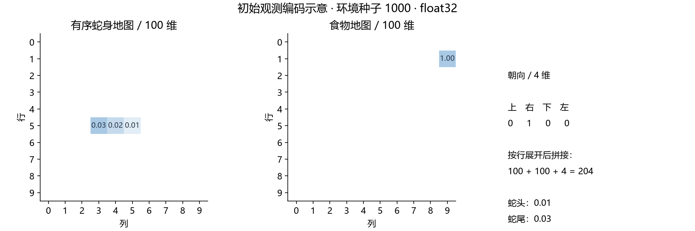
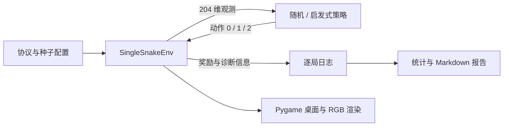
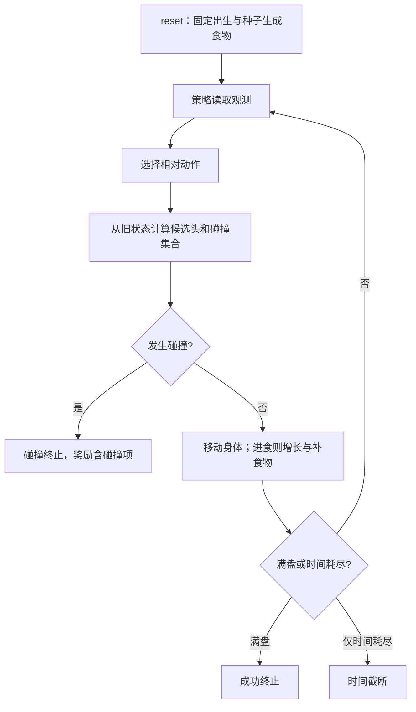
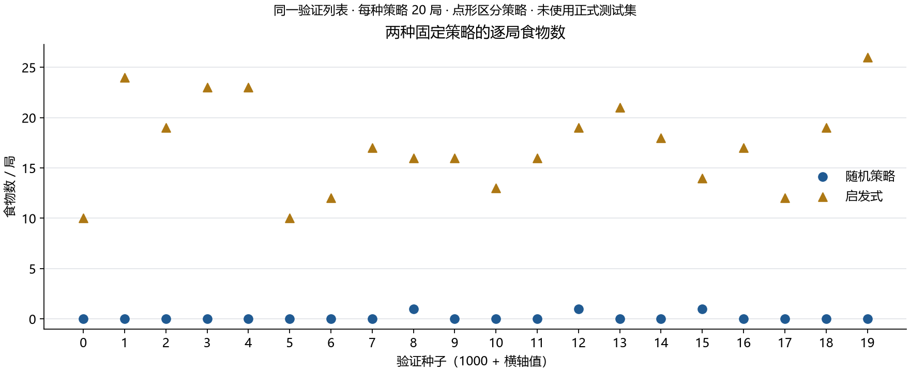
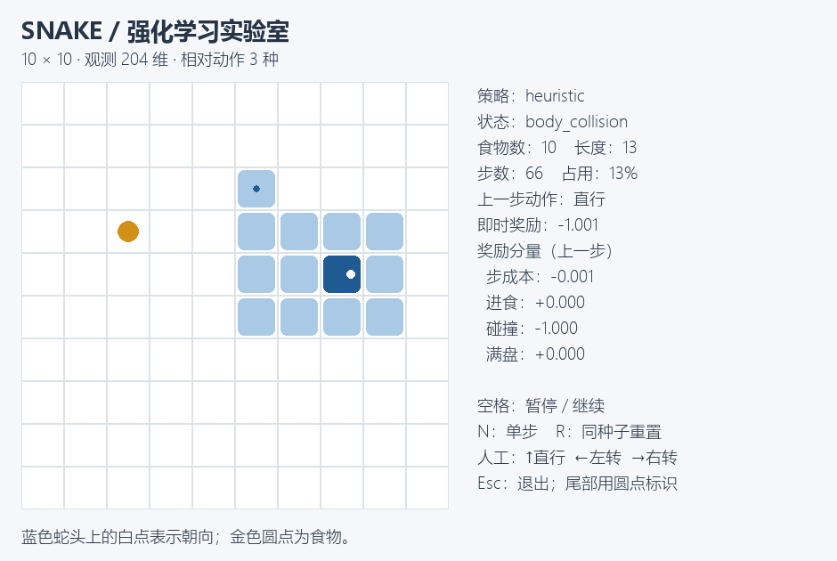

# 单蛇强化学习实验报告：阶段一环境与基线

## 摘要

本阶段实现并验证了固定 10×10 单蛇环境，以及随机、启发式两种无需训练的策略。在预先登记的验证种子 1000–1019 上，每种策略运行 20 局：随机平均食物数为 **0.15**，启发式为 **17.25**。这是固定策略基线结果，尚未实施 DQN 或证明强化学习收益。

完成证据包括环境与策略测试、原始逐局记录、配置和源码哈希、复现命令、示意图与失败轨迹。本报告是后续综合报告的单蛇阶段章节；学生姓名、学号、实际个人贡献由学生填写，未虚构成员信息。

## 1. 任务建模与评价口径

棋盘不穿墙、无障碍，初始蛇为 `(5,5),(5,4),(5,3)`，朝右。动作 `0/1/2` 分别为直行/左转/右转。食物从所有空格中均匀采样。进食增长一格，撞墙或身体终止；未进食时允许进入本步腾出的尾格。长度达到 100 时立即成功，不再生成食物。每局 2000 步为外部截断；终止优先。

观测由有序蛇身地图、食物地图与上/右/下/左 one-hot 朝向组成，按行展平为 204 维 float32。身体先后顺序决定尾格何时腾空，不能仅靠普通占用图替代。



图中非零值展示头到尾的编码；食物图与方向向量单独拼接。该观测保留底层游戏状态，2000 步外部采样预算不属于限时获胜任务，因此未编码剩余时间。

即时奖励及优化目标定义为：

$$
r_{t+1}=-0.001+I_{\rm eat}-I_{\rm collision}+10I_{\rm full},\qquad
J(\pi)=\mathbb E_\pi\left[\sum_{t=0}^{T-1}\gamma^t r_{t+1}\right].
$$

当前固定策略没有优化上述目标。评估主指标为单局食物数；辅助指标为最终长度、占用率、步数、不折扣奖励和、碰撞率、满盘成功数、截断率。终止或截断后的奖励不再累计。技术异常会单独写入失败文件并中止，不静默删除。

## 2. 环境与软件架构



图中策略只读取观测，诊断信息走日志通路；渲染器不改变游戏逻辑。环境每次返回新数组，避免后续训练时污染经验池。碰撞终局保留最后合法棋盘，最后动作与结束原因描述碰撞尝试，终局观测仍属于声明的空间。



本图是阶段一交互流程，尚未加入网络更新。未来 DQN 会在交互记录后添加经验回放与梯度更新，不修改既有基础规则。

## 3. 基线算法与实际代码

随机策略从三个动作等概率采样，包括危险动作；动作随机源与环境随机源分离。启发式只考虑本步可达的安全格，选择到当前食物曼哈顿距离最小者：

$$
d((r,c),(r_f,c_f))=|r-r_f|+|c-c_f|.
$$

并列按直行、左转、右转；无安全动作时直行。以下片段直接从当前实现提取：

```python
    def act(self, observation: np.ndarray) -> int:
        body, food, direction = decode_observation(observation)
        if not body or food is None:
            return 0
        candidates = []
        for action, turn in enumerate(ACTION_TURNS):
            dr, dc = DIRECTIONS[(direction + turn) % 4]
            head = (body[0][0] + dr, body[0][1] + dc)
            eating = head == food
            occupied = body if eating else body[:-1]
            if (0 <= head[0] < BOARD_SIZE and 0 <= head[1] < BOARD_SIZE
                    and head not in occupied):
                distance = abs(head[0] - food[0]) + abs(head[1] - food[1])
                candidates.append((distance, action))
        # 元组排序自然实现同距离时 0→1→2 的协议；全危险时仍返回直行。
        return min(candidates)[1] if candidates else 0
```

启发式排除立即碰撞是其算法定义。随机策略和未来基础 DQN 不额外屏蔽危险动作，因此报告不会将启发式的提升单独归因于距离选择；它同时使用了一步避险规则。

## 4. 实验设计、结果与局限

两个策略在相同的 20 个验证环境种子上各运行一次。随机策略的每局动作种子由配置中的固定基数和环境种子派生。不同策略改变身体和空格集合，因此相同环境种子并不保证之后食物的绝对坐标序列相同。

| 策略 | 局数 | 平均食物数 | 局间样本标准差 | 平均长度 | 平均占用率 | 平均步数 | 平均奖励和 | 碰撞 | 满盘 | 截断 |
| --- | ---: | ---: | ---: | ---: | ---: | ---: | ---: | ---: | ---: | ---: |
| 随机 | 20 | 0.15 | 0.37 | 3.15 | 3.15% | 17.0 | -0.867 | 20/20 | 0/20 | 0/20 |
| 启发式 | 20 | 17.25 | 4.62 | 20.25 | 20.25% | 136.0 | 16.114 | 20/20 | 0/20 | 0/20 |

上表标准差描述同一固定策略在 20 个回合之间的波动，**不是跨训练种子的标准差**。本阶段没有网络训练、模型选择或独立训练重复；不做强显著性声明。单次耗时仅用于本机复现参考。



图中每个点代表一个验证回合，圆点为随机、三角为启发式。分布表明启发式在本验证列表上取得更高食物数，但这并不保证满盘，也不代表其在任意场景或对任何学习算法都占优。正式测试种子 10000–10019 未使用。

### 失败案例与机制

种子 1000 的启发式在第 66 步发生身体碰撞，此前吃到 10 个食物。轨迹见 [逐步轨迹](data/heuristic_seed1000.jsonl)。第 65 步之后，蛇头位于 `(4,7)`，朝右，食物在 `(3,2)`；直行、左转、右转的候选头分别为 `(4,8)`、`(3,7)`、`(5,7)`，三者都是本步不会腾空的身体格。按协议只能回退为直行，因此下一步碰撞。



画面中的头部白点指向右侧，尾部小圆点在上方；候选头所在的三个邻格都被身体围住。策略只最小化到当前食物的距离，没有判断未来可达空间或完整逃生路径；这段回放提供了对“局部避险不能保证长期安全”的具体解释。

这解释了为什么“当前能安全接近食物”不等于长期安全。第一阶段只确认现象与规则逻辑，尚未用受控实验区分长期规划、探索和奖励设计的影响。

## 5. 验证与复现

规则测试涵盖生成食物、增长、相对转向、尾格腾空、墙体/自身碰撞、满盘、终止/截断优先级、观察副本、随机重现和环境空间。基线测试涵盖同分顺序、全危险回退和未屏蔽的随机动作。接口检查通过不替代这些规则案例。

运行环境：Python 3.13.6，Gymnasium 1.3.0，NumPy 2.5.3，Pygame-ce 2.5.8；本阶段使用 CPU，无网络参数更新。精确依赖在 `requirements-lock.txt`。基础环境吞吐另见 `data/benchmark.json`，不把不含优化器的吞吐用作 DQN 训练时长保证。

从仓库根目录执行：

```powershell
snake/.venv/Scripts/python -m pytest -c snake/pytest.ini snake/checks
snake/.venv/Scripts/python -m snake.evaluate --split validation
snake/.venv/Scripts/python -m snake.build_report
snake/.venv/Scripts/python -m snake.demo --policy heuristic --seed 1000
```

原始来源：C:/Users/ruixuanhu/Desktop/RLtoGame/snake/reports/data/baselines_validation_v1。实验来源哈希 `0549255a6f280f56d0725062389ac44c02304082f9d6a84ce10019a218b7220d`，配置哈希 `25a7d96f715bf9972138ecbb11cd6449ed8f07acc5290fce42924cdb6eea768e`；manifest 内保存每个源码文件哈希和配置快照。图表由 `build_report.py` 从 CSV 重建，数值与 summary 对账。未来若环境或算法源码变化，应保留旧运行并创建新目录，不能覆写旧实验来源。

## 6. 后续工作与个人贡献

下一阶段补充张量、MLP、梯度、Q 值与 TD 目标讲义，手写 DQN 核心。Double DQN 对照、三种子训练、验证模型选择、最终测试和正式学习曲线均未开展。

待验证的问题：DQN 是否在相同规则下超过随机基线？是否学到比一步启发式更好的长期行为？Double DQN 在受控预算下是否稳定改善？这些问题须以真实训练结果回答。

环境、基线、测试、材料和报告由 AI 辅助编写与运行。学生应独立阅读、完成复盘练习、复现实验，并记录实际修改与理解；当前不声明学生已经独立实现或完成答辩。正式报告的成员、学号、分工与个人贡献待据实填写。

## 参考资料

- 课程依据：仓库 `outputs/强化学习大作业概述与开发指南.md` 第 2.1、4、6、7 节。
- [Gymnasium 环境接口](https://gymnasium.farama.org/api/env/) 与 [自定义环境](https://gymnasium.farama.org/introduction/create_custom_env/)。
- [Gymnasium 时间限制](https://gymnasium.farama.org/tutorials/gymnasium_basics/handling_time_limits/)。
- [Pygame-ce 官方文档](https://pyga.me/docs/)。
