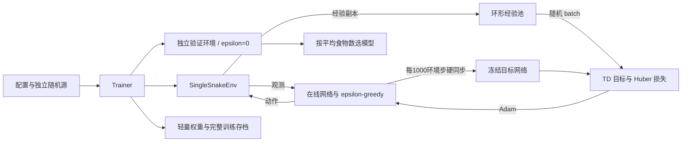
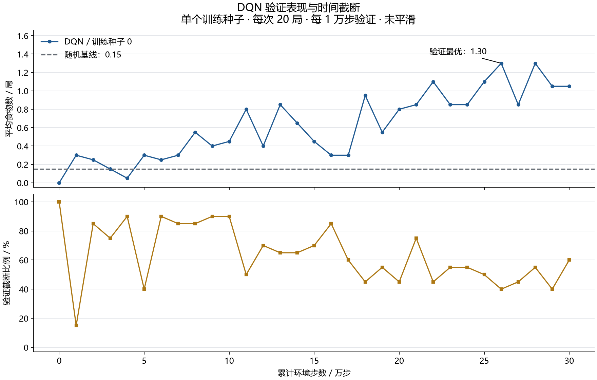
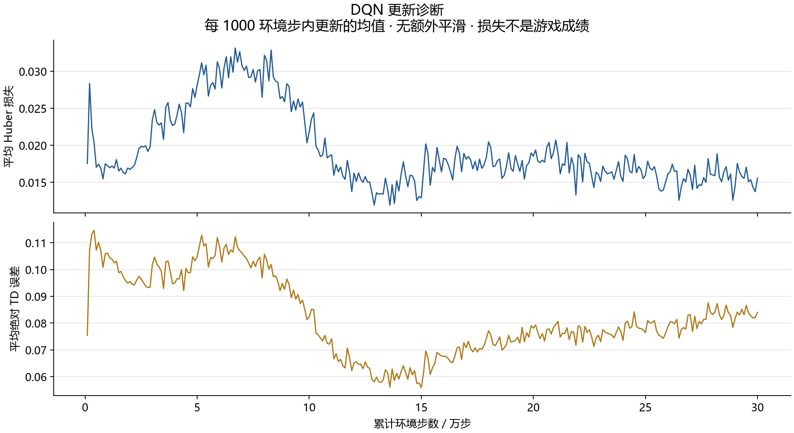

# 单蛇强化学习实验报告：阶段二手写 DQN

## 摘要

本阶段完成了手写 DQN、经验回放、目标网络、探索日程、独立验证、模型演示与完整训练恢复，并运行训练种子 0 的 300000 个环境步。初始网络验证平均食物数为 0，验证最优模型在第 **{{BEST_STEP}}** 步达到 **{{BEST_FOOD}}**，末次为 **{{LAST_FOOD}}**。与第一阶段启发式的 17.25 相比仍有明显差距。

最优模型在 20 个验证回合中有 8 次时间截断。种子 1005 出现持续的 24 步循环，说明该模型仍存在不觅食的存活行为。当前结论限于单个训练种子的验证集，不构成多种子稳定提升或保留测试泛化证据。Double DQN 与剩余正式实验尚未开展。

## 1. 任务与实验定义

使用第一阶段的固定规则：10×10、不穿墙、初始长度 3、相对动作直行/左转/右转、204 维有序身体/食物/朝向观测。每步成本 −0.001，吃食物 +1，碰撞 −1，满盘额外 +10。普通 DQN 不屏蔽危险动作。碰撞/满盘为 terminated，2000 步外部预算为 truncated。

主要指标为单局食物数，辅助观察步数、碰撞率、截断率和奖励和。训练种子 0 控制网络初始化及派生的探索、采样和环境选择随机源；每个训练回合从环境种子 0–999 中均匀选取。验证固定为 1000–1019，每次 20 局；10000–10019 正式测试没有使用。

同一验证集合用于选择 checkpoint，因此最优验证均值可能有选择偏差。表中的标准差是同一模型跨 20 个回合的样本标准差，不是跨训练种子的标准差。

## 2. 网络、目标与工程实现

网络为 `204 → 128 → 128 → 3`，隐藏层 ReLU，总参数量 43139。三个输出是折扣动作价值，不是概率。经验池用固定容量的分列 NumPy 数组实现，保存当前观测、动作、奖励、下一观测、terminated 和 truncated，赋值复制观测。

### DQN 目标和损失

$$
y_i=r_i+\gamma(1-d_i)\max_{a'}Q_{\theta^-}(s'_i,a'),\quad d_i=I_{\mathrm{terminated}},
$$

$$
L(\theta)=\frac1B\sum_i\operatorname{Huber}(Q_\theta(s_i,a_i)-y_i).
$$

目标网络只通过定期硬复制更新，目标计算停止梯度。下面代码来自**本次运行归档的源文件快照**，不是根据结果补写的示例：

```python
{{TD_CODE}}
```

例如奖励为 1、折扣为 0.9、下一状态最大 Q 为 3，普通转移与截断转移的目标都是 3.7，真正终止时为 1。训练循环先把截断前的观测放进回放池，再重置环境。

### 模块架构与数据流



验证使用新的环境实例，不改变训练棋盘，不消耗探索和回放 RNG，也不更新网络参数。初始网络在第 0 步验证并保存，随后每 10000 步验证；同分保留较早 checkpoint。末次权重也独立保存。

完整恢复文件包含在线/目标网络、Adam 状态、经验池、计数器、各 RNG、当前回合棋盘、食物、方向、累计奖励和验证最优模型。本机短 CPU 测试验证了中途保存再恢复后，后续 50 步的轨迹、更新指标和参数逐位一致；这不保证跨设备或跨依赖版本的逐位复现。

## 3. 预先登记的配置与资源

| 配置 | 本次取值 |
| --- | --- |
| 算法与训练种子 | 手写 DQN；0 |
| 学习率与折扣 | Adam 0.001；γ=0.99 |
| 回放容量与 batch | 50000；64 |
| 预热与更新频率 | 1000 条后；每 4 环境步更新 |
| 目标网络与梯度裁剪 | 每 1000 环境步同步；范数上限 10 |
| 探索 | 前 100000 步 ε 从 1.0 线性降到 0.05，之后保持 |
| 总预算与验证 | 300000 环境步；每 10000 步验证 20 局 |
| 模型选择 | 验证平均食物数最大，同分较早 |
| 恢复存档 | 每 50000 步及正常结束保存完整 resume.pt |

软件环境为 Windows / Python 3.13.6 / PyTorch 2.7.1+cu128。新安装已包含 RTX 5070 Ti 所需的 `sm_120`，实际 CUDA 反向传播和参数更新通过验证。

正式选择设备前，在测试进程结束后单独比较相同 DQN 流程：每设备先交互 2000 步，再测 6000 步，期间均更新 1500 次。CPU 单线程约 **4014 步/秒**，CUDA 约 **1487 步/秒**，本次选择 CPU。该小型单环境 MLP 的结论不能直接外推到马里奥视觉网络。第一次测量与测试有时间重叠，作为初测保留；选型采用单独复测文件 `dqn_device_benchmark_isolated.json`。

本次累计 {{UPDATES}} 次梯度更新，完成 {{EPISODES}} 个回合，预算末尾另有一个 19 步未结束回合，已保存以便恢复。训练循环用时约 {{TRAIN_SECONDS}} 秒；包含初始/周期验证、存档和日志等的运行段墙钟约 {{WALL_SECONDS}} 秒。该墙钟起点在 Trainer 创建之后，不包含 Python 导入和网络初次构造。Windows 进程峰值工作集约 {{MEMORY_MIB}} MiB，包括运行、存档及框架内存；本次训练不在 GPU 上更新参数。

## 4. 验证结果：出现觅食改善，但仍弱于启发式

| 模型/策略 | 训练步数 | 平均食物数 | 回合间样本标准差 | 平均步数 | 碰撞 | 截断 |
| --- | ---: | ---: | ---: | ---: | ---: | ---: |
| 随机基线 | 不适用 | 0.15 | 0.37 | 17.0 | 20/20 | 0/20 |
| 启发式基线 | 不适用 | 17.25 | 4.62 | 136.0 | 20/20 | 0/20 |
{{RESULT_ROWS}}

所有行均使用验证环境种子 1000–1019。随机/启发式来自第一阶段保留结果；初始、最优、末次 DQN 来自同一个训练过程，不是三个独立训练种子。最优 checkpoint 重新加载后再评估，20 局结果与训练时验证记录一致。当前各行均无满盘成功。



上图横轴为累计环境步数，每点是 20 局平均食物数，不做额外平滑或跨训练种子的置信区间。下图记录截断比例。模型有一定觅食改善，但较高的截断比例说明部分策略仍在长时间存活而不推进目标；选中模型与末次模型的差异也说明学习表现并非单调改善。



诊断图的每个点是一个 1000 环境步窗口内实际梯度更新的均值，不是一个回合的损失。训练目标和采样分布持续变化，损失下降或波动都需要结合食物数解释。日志中的平均梯度范数也不能排除某次更新存在较大的瞬时梯度。

## 5. 失败案例：24 步循环与身体碰撞

验证种子 1005 的最优模型在第 7 步与第 31 步出现完全相同的 204 维观测，周期为 24 步。归档脚本进一步检查此后直到回合结束的身体、食物、方向和动作都按该周期重复，最终 2000 步截断，食物数为 0。


轨迹图只展示一个完整周期，金色星号是始终未吃到的食物。冻结的确定性策略在相同观测下选择相同动作，且这段循环不触发食物生成，因此会持续重复。这是“存活不等于完成觅食目标”的具体证据。完整 2000 步数据保存在 `data/dqn_seed0_loop1005.json`。

另一个验证种子 1000 在 58 步后发生身体碰撞，吃到 2 个食物；已保存 GIF 和逐步轨迹。示例固定使用验证种子，没有挑选正式测试集中的最好录像。

当前结果不能单独证明某一改进一定有效。可能的后续研究方向包括价值估计、探索覆盖与奖励塑形，但需要按受控实验分别验证，不能同时改变多个因素后统一归因。基础规则与基础 DQN 奖励保留不变。

## 6. 检查、来源与复现

检查覆盖 TD 目标与梯度阻断、在线网络更新、目标冻结/同步、回放副本/环形覆盖/随机状态恢复、验证隔离、截断前观测入池、策略加载、回合中途恢复，以及完整训练与恢复命令。当前单蛇测试包含阶段一规则回归。

报告构建还核对：每个验证步点恰好含 20 个规定种子；训练只使用 0–999；已结束回合步数加预算末尾未结束步数等于 300000；奖励和等于奖励分量和；源码快照与运行时哈希一致；最优选择满足同分较早规则。

```powershell
# 在仓库根目录执行；已交付模型位于 snake/runs/dqn_seed0_stage2/checkpoints
snake/.venv/Scripts/python -m pytest -c snake/pytest.ini snake/checks
snake/.venv/Scripts/python -m snake.learning.dqn_math
snake/.venv/Scripts/python -m snake.demo --checkpoint snake/runs/dqn_seed0_stage2/checkpoints/best.pt --seed 1000
snake/.venv/Scripts/python -m snake.evaluate --checkpoint snake/runs/dqn_seed0_stage2/checkpoints/best.pt --split validation
snake/.venv/Scripts/python -m snake.build_dqn_report
```

原始日志的可提交副本位于 `data/dqn_seed0_training`，包括逐局记录、更新记录、所有验证回合、配置、来源 manifest 与实际运行源码快照。权重与完整经验池存档保留在本地 runs，尚未发布 GitHub 附件；报告和图片重建只需要归档数据。

运行来源哈希：`{{SOURCE_HASH}}`。最优模型 SHA-256：`{{BEST_HASH}}`。其他文件的校验值见归档 summary.json。

## 7. 局限、贡献与下一阶段

本阶段只完成 DQN 种子 0，未进行最终测试，未完成三种子统计或 Double DQN 对照。仅凭这一轮验证集结果，不能声称算法稳定优于随机或具有可靠泛化，更不能声称超过启发式或保证满盘。

环境、DQN、测试、训练运行、讲义与报告由 AI 辅助开发；学生独立理解、修改和复现实验的部分需据实填写。第二课给出了公式到代码的阅读顺序和带答案的复盘题，个人答辩掌握程度尚待实际练习确认。

下一阶段以现有规则和配置为参照，加入只改变 TD 目标选择/评估方式的 Double DQN；补齐 DQN 其余训练种子，比较三种子验证表现后冻结方案，再执行保留测试。如需修改奖励或延长预算，先独立登记假设与受控条件。

## 参考资料

- 课程概述第 3.1、4.3、4.5、6 节：手写 DQN、必要检查、复现与统计规范。
- [DQN 原论文](https://www.nature.com/articles/nature14236)。
- [PyTorch DQN 教程](https://docs.pytorch.org/tutorials/intermediate/reinforcement_q_learning.html)：核对算法概念与张量操作，本项目不使用现成 RL 训练器。
- [Gymnasium 时间限制说明](https://gymnasium.farama.org/tutorials/gymnasium_basics/handling_time_limits/)。
- [PyTorch 历史版本安装](https://pytorch.org/get-started/previous-versions/)。
